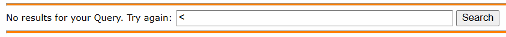
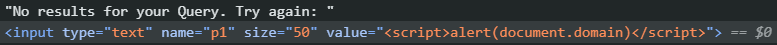
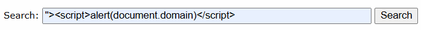

## Stage 2
https://xss-quiz.int21h.jp/stage2.php
**What you have to do:**  
Inject the following JavaScript command: `alert(document.domain);`
**Hint:** *close the current tag and add SCRIPT tag...*

As hinted, let's check for open tags; this time, the response page **doesn't display user input.** 

However, the input is reflected in the "value" attribute in the form being unsanitized, as it displays `<input type="text" name="p1" size="50" value="">`

This means that we can close the attribute and the input tag by typing and submitting `">` in the textbox.
